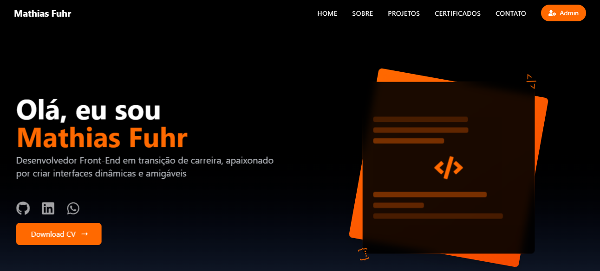
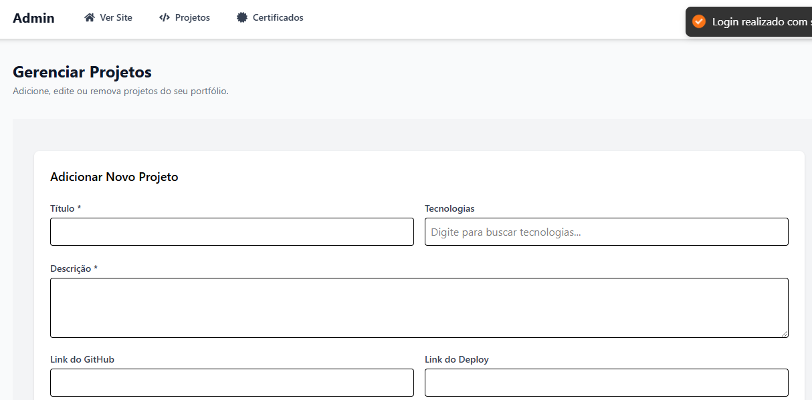
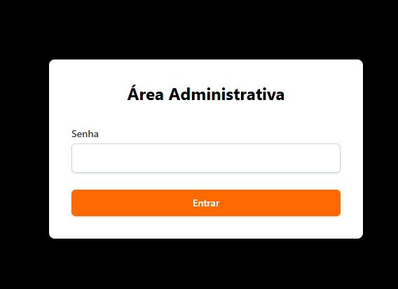

# 🚀 Portfólio - Mathias Fuhr

Este é o meu portfólio pessoal, desenvolvido para exibir meus projetos e certificações, com a capacidade de gerenciar tudo através de um painel admin seguro. O projeto foi construído utilizando as tecnologias mais modernas para oferecer uma experiência fluida e intuitiva.

### 🚀 Acesse o portfólio:
🔗 [Mathias Fuhr - Portfólio](https://newportfolio-dusky.vercel.app/)

---

### 🔧 Tecnologias Utilizadas
- **Vite**: Ferramenta de build rápida para projetos em React.
- **TypeScript**: Para garantir tipagem estática e maior segurança no código.
- **TailwindCSS**: Framework de CSS para criar uma interface responsiva e customizável.
- **Supabase**: Backend como serviço para gerenciamento de dados, autenticação e banco de dados.
- **React**: Framework para construção da interface.
- **Vercel**: Plataforma de hospedagem para o deploy.

---

### ⚙️ Funcionalidades
- **Painel Admin**: Um painel de administração privado onde você pode gerenciar seus projetos e certificados.
- **Autenticação Segura**: Login e autenticação usando Supabase para garantir a privacidade e segurança do painel.
- **Gerenciamento de Projetos**: Adicione, edite e remova projetos diretamente no painel.
- **Gerenciamento de Certificados**: Organize e exiba seus certificados de forma simples.
- **Rota Privada**: Apenas usuários autenticados têm acesso ao painel admin.

---

### 🖼 Screenshots
#### Página Inicial

#### Painel Admin

#### Area restrita

---

### 📄 Licença
Este projeto está sob a licença MIT. Veja o arquivo [LICENSE](LICENSE) para mais detalhes.

---

### 👤 Autor
**Mathias Fuhr**  
- 🌐 [LinkedIn](https://www.linkedin.com/in/mathiasgilvanfuhr/)  
- 📧 mathiasgfuhr@gmail.com
